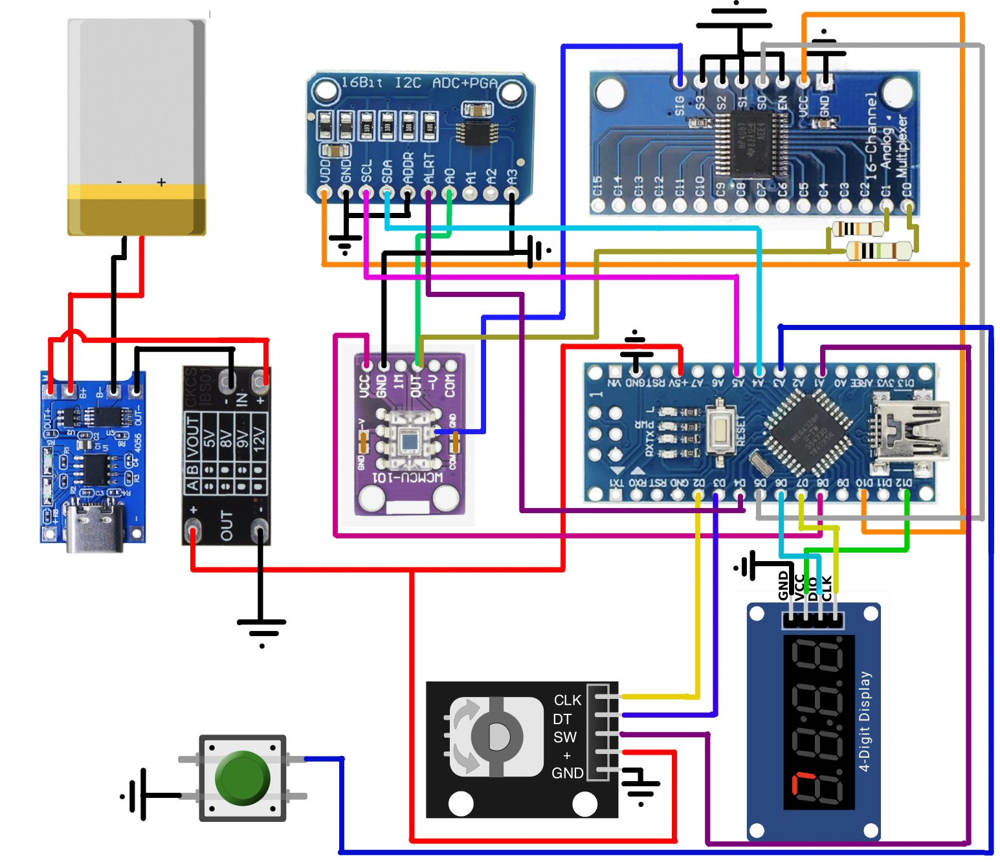

# Экспонометр для даркрума

[3D модель (еще в работе)](https://www.thingiverse.com/thing:7319866)

## Описание

Это экспонометр для даркума. С помощью него можно замерять контраст негативов, а также получать предполагаемое время печати.

Устройство было сделано крайне простым -- в интерфейсе всего одна крутилка и 2 кнопки (одна на энкодере).

Для сборки используются самоые популярные компоненты. Единственный не популярный компонент -- сердце устройства -- это фотодиод OPT101.

### Управление

1. При запуске устройство показывает количество падающего света в logD. 30 logD == 1 стоп. Чем выше значение -- тем темнее падающий свет. Сами по себе значения ничего не значат -- они относительные. То есть значение 50 относительно 90 означает `свет ярче на 40 logD (4/3 стопа)`
2. Нажми на кнопку сбоку устройства, чтобы начать замер относительно текущего значения (`-` -- означает, что свет ярче. `r` -- темнее)
3. Удерживайте кнопку сбоку устройства, чтобы начать показывать снова абсолютные значения
4. Нажмите на энкодер -- чтобы показать приблизительное время печати подсчитанное из базового. Нажмите на энкодер еще раз, чтобы снова начать абсолютных значений logD
5. Удерживайте энкодер, чтобы перейти к установке базового времени (смотри подробнее далее). Нажатие на энкодер дает выбрать устанавливаемое значение в этом меню. Удерживай энкодер, чтобы вернуться назад
6. Удерживай энкодер и кнопку замера, чтобы выключить устройство. Также оно выключится автоматически через 2 минуты

### Калибровка

Устройство желательно откалибровать перед работой. Для этого
1. нужно зайти в темное помещение, в котором нет никакого света
2. накрыть дополнительно датчик чем-нибудь
3. удерживать кнопку энкодера и замера более 5 секунд -- устройство начнет калибровку
4. в это время экран выключится и устройство будет калибровать себя примерно 1 минуту

Чем лучше вы затените устройство, тем точнее будут показания

### Установка базового времени

1. Напечатайте идеальный в плане экспозиции отпечаток
2. Замерьте абсолютные значения logD с печатаемого негатива не меняяя параметры на увеличителе (высоту, дифрагму). Вы можете замерить света/тени/кожу и т.п.
3. Запишите в тетрадку снятые значения в таком формате:
```
Описание объекта на негативе | logD | Время печати
```

Пример
```
кожа в тени     |    323     |   0:40
света яркие     |    220     |   0:40
```

В эту таблицу в будущем можно также добавить название бумаги и другие параметры

4. Перейдите в режим установки базового времени удерживая энкодер
5. Установите базовый logD
6. Нажмите на энкодер -- установите минуты
7. Нажмите на энкодер -- установите секунды
8. Удерживайте энкодер, чтобы запомнить значение и вернуться в режим показа абсолютных logD

Теперь при нажатии на энкодер устройство будет показывать вам предполагаемое время печати относительно указанного базового logD и времени

Например:
1. Вы выставили базовое значение `logD = 200, Time = 00:36` для кожи в тени
2. Вы поставили другой негатив на котором тоже есть кожа в тени.
3. Вы мерите эту кожу и устройство показывает вам `logD == 250`
4. При нажатии на энкодер устройство покажет вам предполагаемое время печати `01:54` (`114 секунд == 36 * 2^(5/3)`)

### Как замерять контраст негатива

1. найдите в абслолютных значениях самый темный или светлый участок на негативе
2. нажмите на боковую кнопку чтобы начать считать значения относительно него и найдите теперь самый светлый/темный участок
3. полученное значение -- контраст негатива в logD

Советы:
1. поднимите увеличительна самый верх, чтобы было удобнее мерить мелкие объекты
2. откройте диафрагму на увеличителе

### Общие советы

1. желательно отключить окружаемый красный свет для улучшения замера
2. используйте кружочек-прицел над датчиком, чтобы мерить свет под прямым углом

## Сборка

### Необходимые компоненты

1. Arduino Nano Type-C. В нем нужно будет выломать диод питания, чтобы он не светил в корпусе. А также для снижения уровня потребления устройства откусить левую ножку стабилизатора напряжения. [Подробнее здесь](https://alexgyver.ru/lessons/power-sleep/#2-toc-title). Углы платы нужно будеть подрезать, чтобы она залезла в корпус
2. Тактовая енопка 12x12x9мм. Высота может быть и другой -- под нее нужно будет просто подобрать крышку
3. Энкодер EC11. Нужно будет отпилить часть энкодера, чтобы на него налезла крутилка
4. 4ех сигментный дисплей на драйвере ТМ1637
5. Аналоговый мультиплексор 74HC4067
6. 16 битный АЦП ADS1115
7. Фотодиодный модуль OPT101. Нужно взять версию с платой на которую он будет крепиться. Продается на aliexpress. [Проверенный лот 1](https://ali.click/hw0l314), [Провереренный лот 2](https://ali.click/wy0l31o)
8. Резистор на 100кОм
9. 3 резистора на 10мОм или 1 на 30мОм. Я соединял 3 резистора на 10мОм, чтобы получить на резистор на 30мОм
10. Медный скотч для экранирования
11. Провода
12. гайки и винты m3 на 5 и 10 (можно повыше)
13. Оргстекло 2мм, чтобы сделать прицел для наводки на фотодиод

Следующие компоненты опциональны. На случай если вы захотите сделать автономное устройство работающее от батареи
1. Плата зарядки TP4056
2. Преобразователь напряжения CKCS BS01 (5V)
3. Аккумулятор размерами до 10x34x50. Я брал Литий-полимерный 103450 2000 мАч 3,7В

Для стиля и затенения подсветки поверх экрана можно наложить полупрозрачный акрил

### Схема

> *Note:*  Пунктирным светом помечена часть отвечающая за питание от батарейки. Если вам не нужно, чтобы устройство работало автономно, то можете его не ставить



### Особенности сборки

1. Фотодиод очень хорошо ловит внешние помехи. Поэтому весь корпус нужно изнутри проэкранировать медный скотч и приклеить землю к нему
2. Выровните диод посередине дырки
3. Батарея расположена под фотодиодом. Чтобы ножки диода не замыкались под ним -- произолируйте батарею изолентой

### Видеоинструкция по сборке

// TODO

### Прошивка

Самый простой способ залить прошивку -- через Arduino IDE
3. Поставте Arduino IDE
1. Склонируйе этот git проект в любую из директорий
2. Откройте ino файл через Arduino IDE (`File`->`Open...`->`path to .ino` file)
4. Установите зависимости проекта (`Tools` -> `Manage Libraries...`):
    * EncButton (by Alex Gyver)
    * GyverIO (by Alex Gyver)
    * GyverSegment (by Alex Gyver)
    * GyverPower (by Alex Gyver)
    * PinChangeInterrupt (by Nico Hood)
    * CRC32 (by Crystopher Baker)
    * ADS1X15 (by Tob Tillaart)
5. Выберете board -- Arduino Nano и processor --  ATmega328P
6. Нажмите на кнопку Upload

## Поддержка

tg: @lo1ol
email: myprettycapybara@gmail.com
